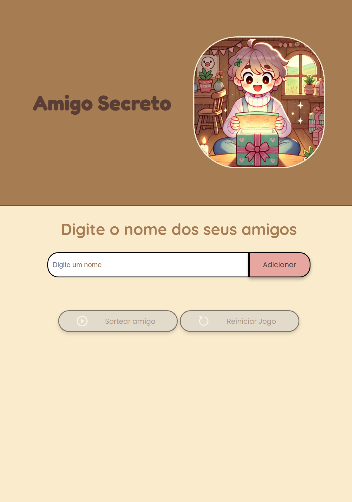

  
# Sorteio de Amigos (Amigo Secreto)


Este projeto foi desenvolvido como parte de um desafio proposto pelo programa **Oracle Next Education (ONE)**, com o objetivo de praticar conceitos de programação em JavaScript, HTML e CSS. A aplicação permite criar uma lista de participantes e sortear um amigo secreto de forma aleatória, recriando a brincadeira tradicional de amigo secreto.


## Interface do Jogo:


## Objetivo do Projeto

O desafio consiste em criar uma interface simples onde o usuário pode:
1. Adicionar nomes de amigos à lista.
2. Visualizar a lista de participantes.
3. Sortear um amigo secreto aleatoriamente.
4. Reiniciar o jogo para uma nova rodada.

O projeto foi desenvolvido utilizando **HTML**, **CSS** e **JavaScript**.

## Funcionalidades

- **Adicionar Amigos**: Adicione nomes de amigos à lista.
- **Listar Participantes**: Visualize todos os participantes adicionados.
- **Sortear Amigo Secreto**: Sorteie um amigo aleatoriamente da lista.
- **Reiniciar Jogo**: Reinicie o jogo, limpando a lista de participantes e o resultado do sorteio.

## Como Usar

1. **Adicionar Amigos**:
   - Digite o nome do amigo no campo de entrada.
   - Clique em "Adicionar" para adicionar o nome à lista.
   - É necessário adicionar pelo menos 3 amigos para habilitar o sorteio.

2. **Sortear Amigo Secreto**:
   - Após adicionar pelo menos 3 amigos, clique em "Sortear amigo" para sortear um amigo aleatoriamente.
   - O nome do amigo sorteado será exibido na tela.

3. **Reiniciar Jogo**:
   - Clique em "Reiniciar jogo" para limpar a lista de amigos e o resultado do sorteio.
   - O jogo será reiniciado e você poderá adicionar novos amigos.

## Estrutura do Projeto

- **index.html**: Contém a estrutura HTML do projeto.
- **style.css**: Contém os estilos CSS para a interface do projeto.
- **script.js**: Contém a lógica JavaScript para adicionar amigos, sortear e reiniciar o jogo.

## Como jogar
Você pode acessar o projeto diretamente na web:  
[Amigo Secreto Online](https://one-challenge-amigo-secreto-omega.vercel.app)

## Como Executar o Projeto

1. Clone o repositório:
   ```bash
   git clone https://github.com/Batppam/One-ChallengeAmigoSecreto


## Contato

Se você tiver alguma dúvida ou sugestão, sinta-se à vontade para entrar em contato:

- Nome: Pâmela Peron
- Email: peronpamela@gamil.com
- GitHub: Batppam

## Licença
- The [MIT License](https://github.com/Batppam/One-ChallengeAmigoSecreto/blob/main/LICENSE) (MIT)
- Copyright ©️ 2025 - Jogo do Amigo Secreto

## Agradecimento Especial


Agradeço especialmente à [Oracle Next Education](https://www.oracle.com/br/education/oracle-next-education/) e a [MCIO](https://mciobrasil.org.br/SitePages/home.aspx) por me proporcionarem esta oportunidade.
